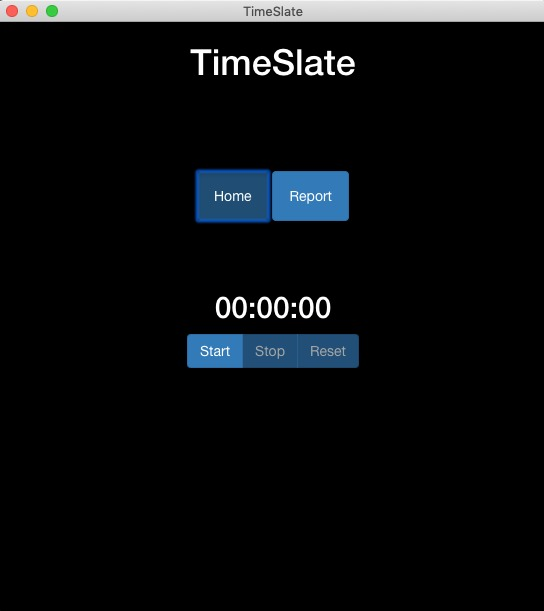
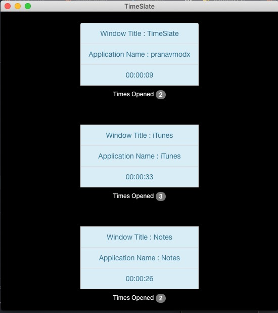
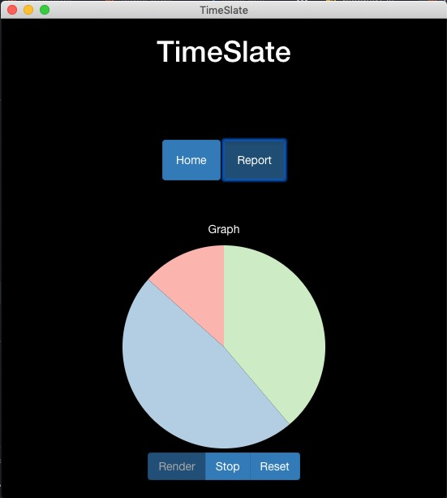

# TimeSlate
An Electron JS desktop application which keeps track of usage time of different applications (active ones) running on computer and displays it along with an analysis report.

## App Screenshots





## Usage

* Clone/Download the source code
  
* Install all requirements
  ``` 
  npm install
  ```
  or 
  ```
  yarn install
  ```
  
* Run :
  ```
  npm start
  ```
  or 
  ```
  electron .
  ```

* The application window will open

* Navigate through the project
